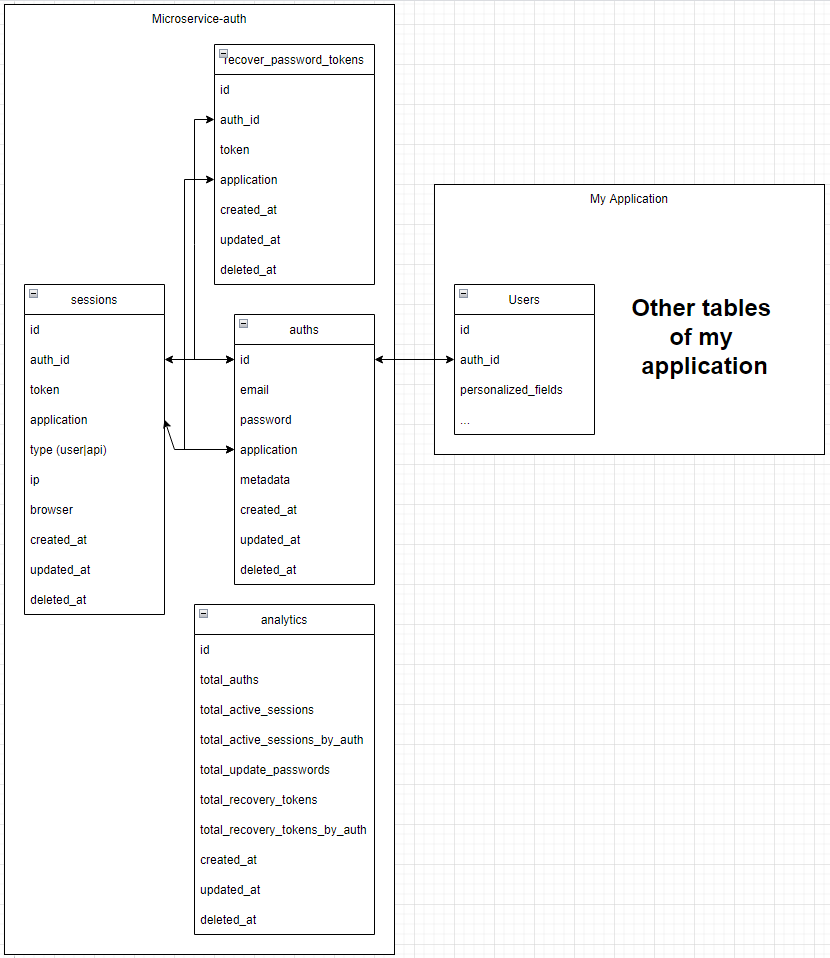

        

# Microservice Authenticator

          

Are you a developer? already with several different projects and had to authenticate to all of them? Why you don't up a authenticator microservice that will connect with every your projetcs that will connect to all your projects and instead of having to implement a new authentication applicationto to each new application? 
you need up this project only one time, integrate with your systems and use it, you don't need implement all authetication part and a new improve in this project will be a new improve for all your projects. Microservice Auth have all part of authentication in a application focused to resolve auth, so this project is small and
easier to manutence.

```This is a Open Source project, be free to improve it.```

## This project use Nest with Typescript and TypeORM and is divided in this parts:


    .
    ├── src
    ├──── app
    ├────── analytics (Responsable for reports)
    ├────── auth (Responsable for create/auth users)
    ├────── recover-password (Responsable for create and send recovery tokens/validate recovery tokens/update password by recovery token)
    ├────── session (Responsable for create and storage the sessions of logged users, this sessions can be consulted to validate if a user is connected)
    ├────── mail (This module is called when there are events to send email, like create a new auth/user or to send recovery token to email, the proccess will do in other microsservice because be a email sender doens't a function to this microsservice)
    └── README.md
    
```
Futuro implementations:
- Put in the .env if user can have only a active and logout other session when have a new login
- Auth by QRCode
- Block user(ban)
```

## Requests

<p>In request folder there are examples if requests that can be dispatched by Visual Code, to use you need instal the extension "REST Client"</p>
<p>Link to extension https://marketplace.visualstudio.com/items?itemName=humao.rest-client</p>


    .
    ├── requests
    ├──── analytics.http
    ├──── analytics.http
    ├──── auth.http
    └──── recover-password.http


### Features list

```
"application" param weill be utilized to validate who application the person is referencing
ex: application: "gmail"|application: "easychannel"|application: "rede_social"
```

## Auth

- Create Login
- Login

## Session

- Validate a session token and who is session token user
- List all session token by user with token
- Logout current user session
- Logout all user sessions

## Recover Password

- Create and send the recovery token to recover password to e-mail
- Validate if the recovery token is valid
- Update user/auth password based in recovery token

## Analytics

- Momento report
- List daily reports

```
A record on analytics table is renerated all days at 1AM, because it is possible have a historic of new users, active sessions, sessions by user and more.
```

## How to vinculate a microsservice auth login with my system?

Generaly when we create a system, the user have authentication proprierty(password for example), instead this data stay in user table we put only auth_id and this auth_id in vinculated with a microsservice-auth that have to be created when the user registar on your system/logou or realize login, when realize login, de microsservice-auth
will return the auth_id thar will be vinculated to a user in your system.

<p align="center">

</p>

<hr />

Opinions, criticisms, suggestions, opinions are welcome, just send them to my email: ```felipe.wget.@gmail.com```
